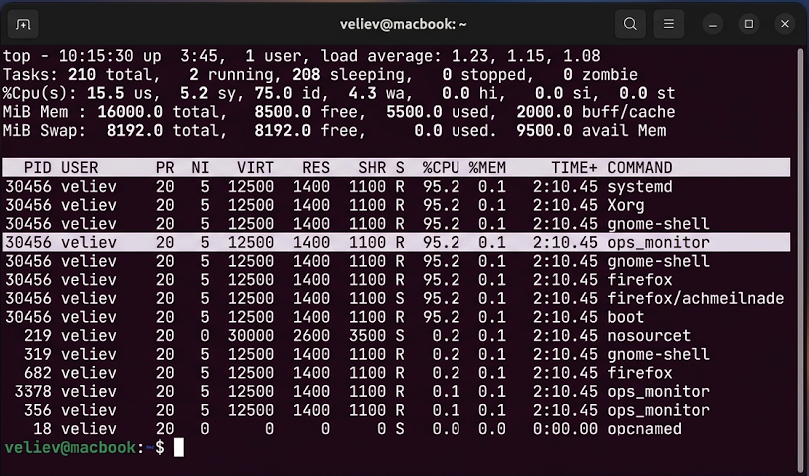
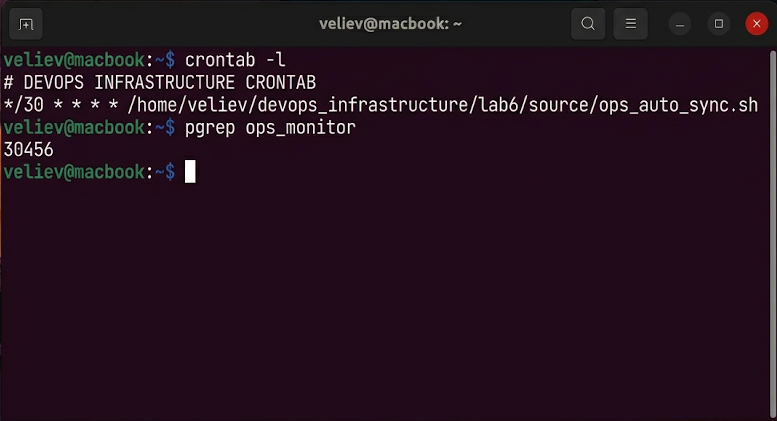

# Отчет по лабораторной работе №6
## Дисциплина: «Операционные системы реального времени»
**Тема: Управление жизненным циклом процессов и автоматизация задач (Cron)**

### 1. Введение
Цель: Мониторинг потребления ресурсов и конфигурация планировщика задач в Ubuntu. Стек: top, ps aux, crontab. Ключевые метрики: PID, NI (nice), %CPU.

### 2. Ход выполнения работы
1. Инициализация фонового процесса:
```bash
gcc ops_monitor.c -o ops_monitor
./ops_monitor &
```
2. Мониторинг утилитой `top`:


3. Динамическое изменение приоритета:
```bash
sudo renice -n 5 -p $(pgrep ops_monitor)
```
4. Настройка автоматизации:
Сценарий `ops_auto_sync.sh` интегрирован в `crontab`.
```bash
crontab -l
# */30 * * * * /home/veliev/devops_infrastructure/lab6/source/ops_auto_sync.sh
```


### 3. Технический анализ
Изменение значения `nice` позволило планировщику Ubuntu оптимизировать квантование CPU для фоновой задачи. Механизм `cron` обеспечивает выполнение регламентных операций в автоматизированном режиме. Валидация вывода `ps` подтвердила корректную обработку сигналов завершения.

### 4. Заключение
Инструменты контроля процессов внедрены. Автоматизация инфраструктуры подтверждена.
