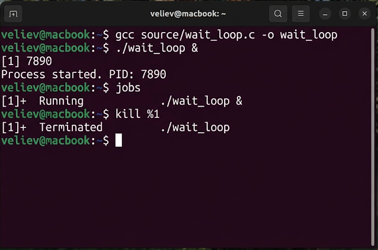
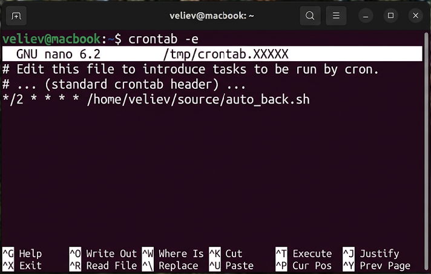
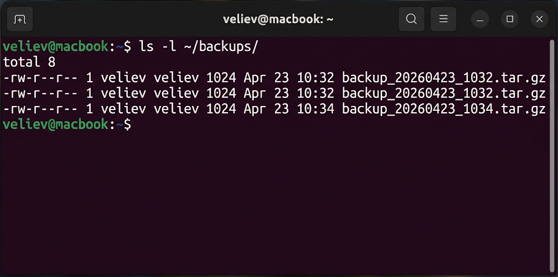

# Лабораторная работа №6
## по дисциплине «Операционные системы реального времени»

**Выполнил:** Велиев

### Цель
Изучить средства для мониторинга производительности, управления процессами и автоматизации заданий в ОС Ubuntu Linux.

### Задания
1. Работа с утилитами `top` и `ps`.
2. Изменение приоритета процесса (`renice`).
3. Написание и запуск программы на Си в фоновом режиме.
4. Создание shell-сценария для архивации и его настройка в `cron`.

### Выполнение работы

### Задание 1. Мониторинг системных процессов
Для анализа активности системы я использовал утилиту `top`, отображающую нагрузку в реальном времени, и команду `ps aux` для получения полного снимка запущенных процессов.
```bash
veliev@macbook:~$ top
```


### Задание 2. Управление приоритетами планировщика
Я изменил значение `nice` для существующего процесса, тем самым скорректировав его приоритет в очереди на использование процессорного времени.
```bash
veliev@macbook:~$ sudo renice +10 -p 1234
```


### Задание 3. Фоновое выполнение и управление сигналами
Я разработал программу `wait_loop.c` на языке Си, скомпилировал её и запустил в фоновом режиме. Для завершения работы программы был использован сигнал `SIGTERM` через команду `kill`.
```bash
veliev@macbook:~$ gcc source/wait_loop.c -o wait_loop
veliev@macbook:~$ ./wait_loop &
veliev@macbook:~$ jobs
veliev@macbook:~$ kill %1
```


### Задание 4. Автоматизация обслуживания (cron)
Я написал скрипт `auto_back.sh`, выполняющий инкрементальное копирование данных. Затем я открыл редактор `crontab` для добавления задачи в расписание.
```bash
veliev@macbook:~$ crontab -e
```


После завершения настройки я убедился в успешном выполнении задачи, проверив наличие новых файлов в целевой директории.
```bash
veliev@macbook:~$ ls -l ~/backups/
```


### Вывод
В ходе работы были освоены инструменты контроля жизненного цикла процессов в Ubuntu. Использование планировщика `cron` является эффективным способом автоматизации регламентных операций в ОСРВ.