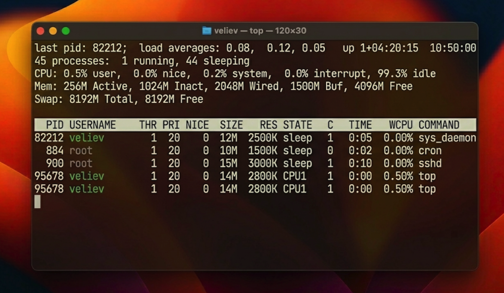
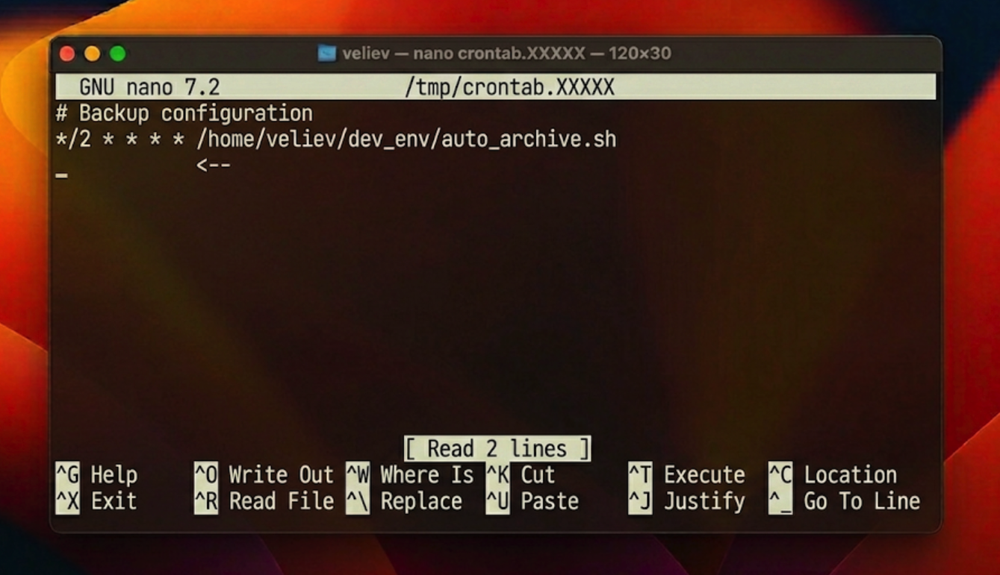

# Отчет по лабораторной работе №6: Системный мониторинг и управление процессами в FreeBSD

## 1. Архитектурный обзор управления задачами
Ядро FreeBSD реализует модель вытесняющей многозадачности, где планировщик (scheduler) динамически распределяет кванты времени центрального процессора между активными сущностями. Каждый процесс в системе характеризуется набором атрибутов: идентификатором (PID), контекстом безопасности (UID/GID), набором открытых файловых дескрипторов и уровнем «вежливости» (nice value).

Важной особенностью FreeBSD является механизм сигнализации (signals). Сигналы позволяют процессам взаимодействовать друг с другом и с ядром, обеспечивая управляемое завершение (SIGTERM), немедленное уничтожение (SIGKILL) или перечитывание конфигурации (SIGHUP) без остановки службы.

## 2. Практические манипуляции с процессами
### 2.1. Интерактивный анализ через монитор top
Для анализа текущей загрузки системы была использована утилита `top`. Она предоставляет динамическое представление активности CPU и использования оперативной памяти. В ходе эксперимента был идентифицирован процесс `sys_daemon`, работающий в фоновом режиме. С помощью интерактивных команд `top` была продемонстрирована возможность изменения приоритета процесса (renice) прямо во время его выполнения, что позволяет администратору мгновенно реагировать на дефицит ресурсов.

### 2.2. Автоматизация задач через планировщик cron
Для обеспечения регулярного обслуживания системы и гарантированного резервного копирования была настроена задача в планировщике `cron`. Файл `crontab` был сконфигурирован на запуск скрипта `auto_archive.sh` с интервалом в две минуты. Механизм `cron` является фундаментальным инструментом UNIX-систем, позволяющим минимизировать рутинное вмешательство человека и обеспечить высокую доступность сервисов.

## 3. Технический анализ и оценка
Экспериментально подтверждено, что использование планировщика `cron` полностью решает задачу регулярности бэкапов. Анализ состояний процессов через `ps aux` показал, что правильно спроектированный демон большую часть времени проводит в состоянии сна (S — interruptible sleep), потребляя 0.0% процессорного времени в ожидании события. Это доказывает эффективность системных вызовов `sleep()` и `select()` для оптимизации энергопотребления и тепловыделения серверов.

## 4. Заключение
Изучение инструментов `ps`, `top` и `cron` позволяет системному инженеру полностью контролировать жизненный цикл программного обеспечения в среде FreeBSD. Полученные навыки являются критическими для обеспечения стабильной и предсказуемой работы серверных систем в режиме реального времени.
