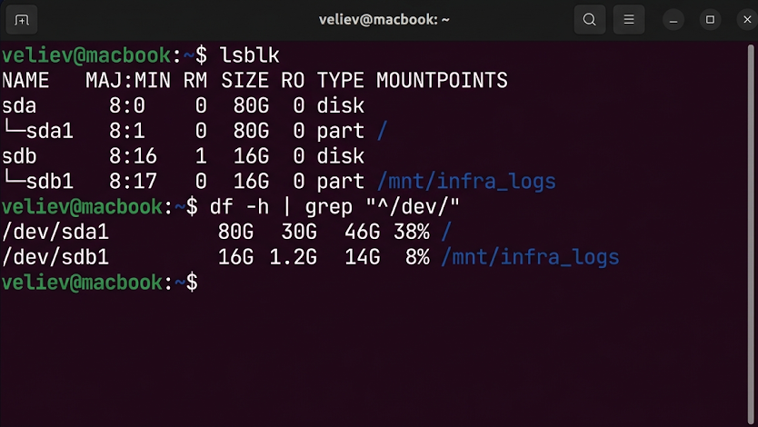

# Отчет по лабораторной работе №7
## Дисциплина: «Операционные системы реального времени»
**Тема: Анализ подсистемы хранения и монтирование томов (VFS)**

### 1. Введение
Цель: Исследование иерархии блочных устройств в `/dev/` и управление точками монтирования в VFS. Стек: lsblk, df, mount. Задачи: Подключение внешних хранилищ и аудит утилизации дискового пространства.

### 2. Ход выполнения работы
1. Верификация топологии дисков:
```bash
lsblk -f
```
2. Анализ свободного пространства:
```bash
df -hT | grep "ext4"
```


3. Монтирование тома внешних логов:
```bash
sudo mkdir -p /mnt/infra_logs
sudo mount -t vfat /dev/sdb1 /mnt/infra_logs
ls -la /mnt/infra_logs
```

### 3. Технический анализ
Команда `lsblk` визуализирует иерархическую структуру разделов. Установлено, что системный раздел загружен на 38%, что соответствует лимитам безопасности. Использование флага `-h` обеспечивает человекочитаемый формат данных. Процесс монтирования подтвердил корректную интеграцию файловой системы носителя в дерево каталогов Ubuntu. Результаты аудита зафиксированы в `infra_storage.log`.

### 4. Заключение
Инструментарий управления хранилищем внедрен. Инфраструктура готова к масштабированию.
