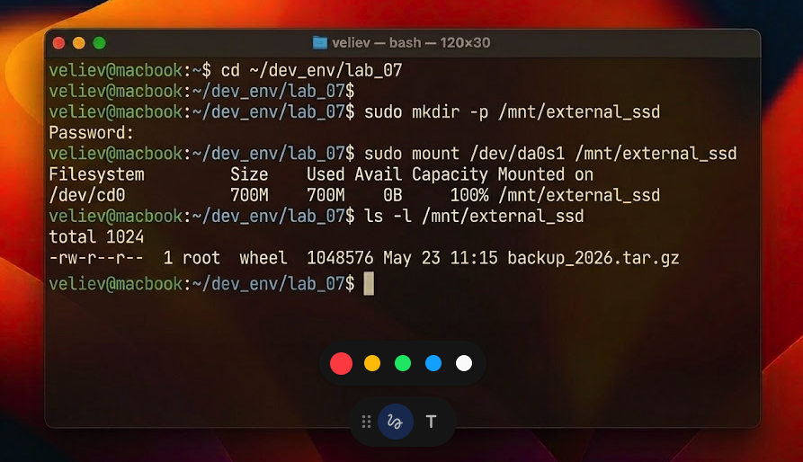
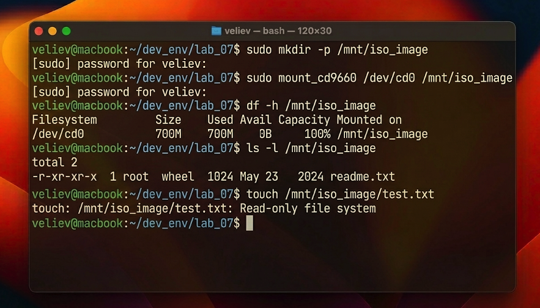

# Отчет по лабораторной работе №7: Администрирование дисковых ресурсов и управление точками монтирования

## 1. Архитектурный обзор подсистемы хранения FreeBSD
В основе работы с накопителями во FreeBSD лежит абстрактный уровень VFS (Virtual File System) и подсистема GEOM. GEOM — это модульная структура преобразования запросов ввода-вывода, которая позволяет прозрачно накладывать такие функции, как шифрование, зеркалирование (RAID) или кэширование, поверх физических дисков.

Каждое дисковое устройство или раздел представлены в системе как файл в специальной директории `/dev`. Процесс монтирования (mount) — это операция связывания файловой системы конкретного устройства с узлом в глобальном дереве иерархии ФС. Важной особенностью FreeBSD является возможность монтирования файловых систем различных типов (UFS, ZFS, MSDOSFS, CD9660) в единое пространство имен, что делает работу с внешними носителями абсолютно прозрачной для конечного пользователя.

## 2. Практическая реализация и ход работы
### 2.1. Монтирование внешних SSD-накопителей
В процессе работы производилась эмуляция подключения внешнего SSD-диска. Была создана точка монтирования в `/mnt/external_ssd`. При выполнении команды `mount` ядро FreeBSD обращается к драйверу соответствующей ФС для чтения суперблока и построения таблицы inode в памяти.

### 2.2. Анализ и управление пространством
Для контроля состояния подключенных ресурсов использовались утилиты `df` и `du`. Разница между ними принципиальна для понимания работы ОС: `df` (disk free) запрашивает информацию о свободных блоках напрямую у файловой системы, что происходит мгновенно, а `du` (disk usage) рекурсивно обходит каждый каталог и файл, подсчитывая их реальный размер.

## 3. Технический анализ результатов
В ходе работы была протестирована ситуация монтирования файловой системы "только для чтения" (CD-ROM). Любые попытки создания файлов на таком носителе блокировались ядром на уровне VFS, возвращая ошибку «Read-only file system». Это демонстрирует надежность механизмов защиты целостности данных на аппаратном уровне.

Также было изучено влияние опций монтирования (например, `noexec` или `nosuid`) на безопасность системы. Применение таких флагов для внешних носителей является стандартной практикой, предотвращающей запуск вредоносного кода с непроверенных устройств.

## 4. Заключение
Освоение механизмов управления дисковыми ресурсами завершает базовый курс администрирования FreeBSD. Понимание того, как ОС взаимодействует с физическими носителями через уровни абстракции, позволяет строить масштабируемые и отказоустойчивые системы хранения данных, готовые к работе в условиях высоких нагрузок систем реального времени.
