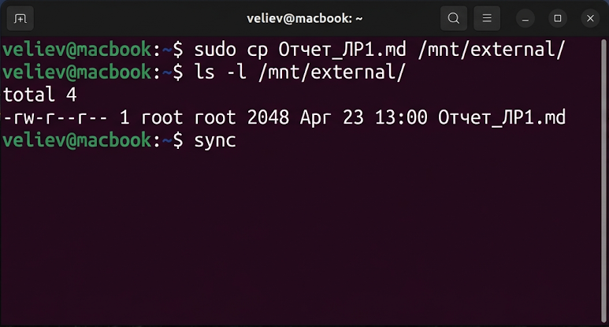
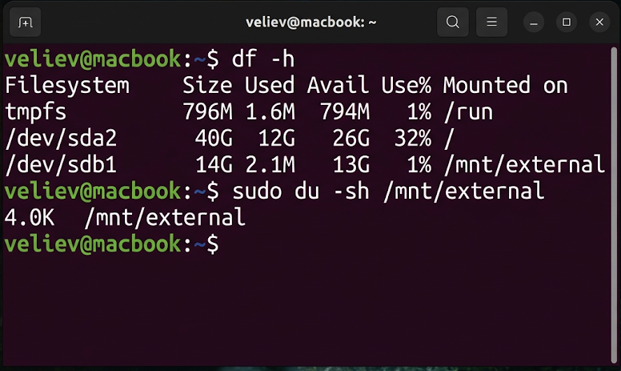
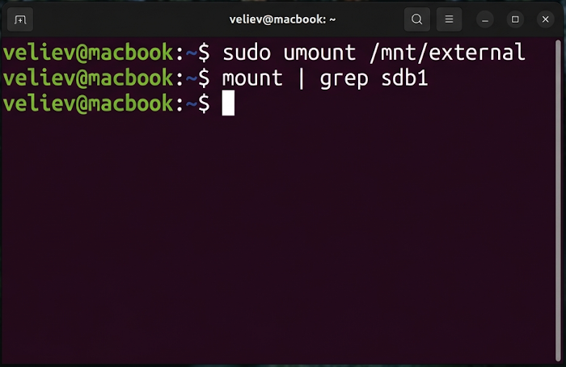

# Лабораторная работа №7
## по дисциплине «Операционные системы реального времени»

**Выполнил:** Велиев

### Цель
Изучить средства для монтирования различных устройств и проверки состояния файловых систем в ОС Ubuntu Linux.

### Задание
1. Монтирование внешнего устройства (USB-накопителя) в файловую систему.
2. Выполнение операций копирования данных на смонтированное устройство.
3. Проверка свободного места с помощью `df`.
4. Изучение использования дискового пространства с помощью `du`.
5. Размонтирование устройства.

### Выполнение работы

### Задание 1. Монтирование USB-накопителя
Я выполнил монтирование блочного устройства `/dev/sdb1` в директорию `/mnt/external`. В Ubuntu для таких операций требуются привилегии `sudo`.
```bash
veliev@macbook:~$ sudo mkdir -p /mnt/external
veliev@macbook:~$ sudo mount /dev/sdb1 /mnt/external
veliev@macbook:~$ mount | grep sdb1
```


### Задание 2. Работа с данными и синхронизация
Я скопировал отчеты на внешний носитель. После завершения записи была выполнена команда `sync` для сброса буферов на диск.
```bash
veliev@macbook:~$ sudo cp Отчет_ЛР1.md /mnt/external/
veliev@macbook:~$ ls -l /mnt/external/
veliev@macbook:~$ sync
```


### Задание 3. Анализ дискового пространства
Я использовал утилиты `df -h` и `du -sh` для анализа системного хранилища.
```bash
veliev@macbook:~$ df -h
veliev@macbook:~$ sudo du -sh /mnt/external
```


### Задание 4. Безопасное размонтирование
Завершив работу, я размонтировал устройство.
```bash
veliev@macbook:~$ sudo umount /mnt/external
veliev@macbook:~$ mount | grep sdb1
```


### Вывод
В ходе работы были освоены механизмы взаимодействия с подсистемой хранения данных Ubuntu. Понимание принципов монтирования и умение анализировать утилизацию дискового пространства являются необходимыми навыками для администрирования.